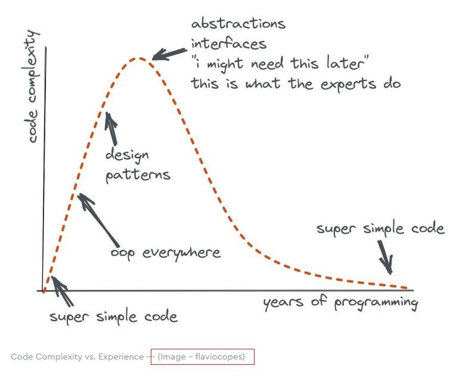
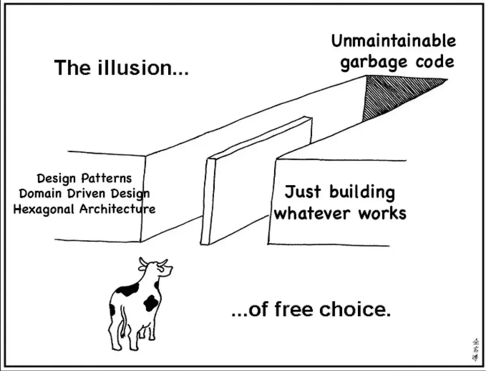

## Introduction
-----

The role of AI has significantly impacted the world of Software Engineering, from the way in which developers work, collaborate and solve their problems. AI tools like Chat GPT, for example, are able to generate code in a matter of seconds, drastically speeding up the development process. Although the accuracy of the generated code often depends on the quality of the user’s input, these tools prove to be invaluable for developers by streamlining workflows and reducing the amount of time and effort spent on repetitive tasks. Beyond just code generation, AI tools can also enhance code quality of the code by detecting bugs, errors, and potential security vulnerabilities.

In the context of my experience in ICS 314, AI tools have been instrumental in helping me understand software engineering concepts, especially in both front-end and back-end development. For example, in projects involving React and JavaScript, ChatGPT provided suggestions that improved component rendering and helped troubleshoot numerous ESLint errors. Besides ChatGPT, I’ve also had the opportunity to use Live Share in Visual Studio Code, which enabled real-time collaboration on group projects. This feature made it easier to work with classmates, similar to the way Google Docs allows for numerous users to document and edit at the same time.


## Personal Experience with AI
-----

Initially, I was hesitant about using AI due to the negative perceptions surrounding its use in writing assignments. People often referred to it as the "easy way out," and most professors discouraged it, but this course was different. At first, I stubbornly refused to rely on AI for help. However, I gradually turned to it to better understand new concepts, especially since I had so much to learn from scratch—like using GitHub and GitHub Desktop, merging branches via pull requests, recognizing patterns in code, and learning how certain functions work and how to debug them. Depending on the topic, mastering these skills could take anywhere from a few hours to several days of practice.


*Experience WODs*
-----
The Experience WODs were a more casual version of the in-class WODs, serving as a "trial run" before the official tests. They allowed multiple attempts for each code prompt, giving us a chance to try different solutions and refine our skills. Unlike the practice WODs, where I relied heavily on AI, during the Experience WODs I decided to take a different approach. I made a conscious choice not to use AI, thinking that doing it on my own would help me learn better. When I got stuck, instead of turning to ChatGPT, I preferred to watch the instructional videos provided, trying to work through the problems independently. This method definitely slowed me down, but I felt that it would give me a stronger foundation in the long run. I spent a lot of time figuring things out myself, sometimes struggling for longer than necessary, but this approach helped me internalize the concepts more deeply, even if it took me longer to get through the tasks.


*In-class Practice WODs*
------
The in-class Practice WODs were designed to help us get used to the pressure of the official ones, which could last anywhere from twenty minutes to an hour. Unfortunately, I didn’t fully take advantage of these practice runs. Instead of using them as an opportunity to engage more deeply with the material, I just went with the flow. I relied heavily on AI to get through the problems, thinking it would be a quick fix, even though these sessions were meant to be low-stakes and a chance to make mistakes without pressure. I didn’t ask for help from instructors or peers, missing out on valuable learning moments. In hindsight, those practice WODs were the perfect time to focus on building my skills, but I relied too much on AI to do the heavy lifting. Later, I realized that if I’d pushed myself to work through the problems on my own and sought help when needed, I would have been better prepared for the real challenges ahead.


*In-class WODs*
-----
The WODs (Workouts of the Day) were a brutal test of my endurance, both mentally and physically. Nothing quite prepared me for the stress and frustration they caused, especially as I raced against the clock, trying to solve timed coding prompts under intense pressure. My first official WOD was a turning point. I had decided to tackle it alone, relying on the limited knowledge I had at the time. I quickly realized this was a decision I would come to regret.

In those early moments, I was so focused on getting the code right that I started leaning heavily on AI tools like ChatGPT. While the instant feedback and suggestions seemed like a lifeline at first, they ended up doing more harm than good in the long run. Instead of forcing myself to work through problems and learn the underlying concepts, I took the easy way out, letting AI do much of the heavy lifting for me.

Halfway through, it became painfully clear that relying on AI in this way wasn't helping me develop the skills I needed. I wasn't gaining the deep understanding I thought I was. In fact, it was just slowing me down. That's when I shifted my approach. I started using AI more strategically—less as a crutch and more as a tool to supplement my learning. I began to ask more targeted questions, seeking clarification or suggestions for optimization rather than just copying answers.

Looking back, I realize that my early reliance on AI, while it seemed like a shortcut, ultimately hinder my growth. If I'd approached those WODs with a more deliberate mindset—using AI more effectively from the start—things might have gone differently. But in the end, that struggle taught me how to work through problems on my own, while also using AI to enhance my learning, not replace it.

*Esssays*
-----
I used ChatGPT to help with my technical essays, mainly to fix spelling errors and improve sentence flow. After writing my drafts, I'd ask ChatGPT to catch mistakes and reword awkward sentences, making my work clearer and more polished without changing the content. It helped me present my ideas more effectively.


*Final Project*
-----
After watching a YouTube video on implementing a search bar, I decided to create a similar feature for a product page in my project. While the tutorial gave me a basic understanding, I turned to ChatGPT to clarify certain concepts and ensure I was following best practices.

I needed help understanding how the getServerSession method in Next.js worked with authentication and how it integrated with my Prisma query. ChatGPT explained how sessions function and how to use the loggedInProtectedPage function to protect the page.

Additionally, the tutorial briefly touched on fetching data, but I wasn’t sure how to structure a case-insensitive Prisma query. ChatGPT clarified how to use the findMany query with the contains operator and pass the search query dynamically, ensuring the results were filtered correctly.

I also sought advice on organizing the components for better code structure. ChatGPT helped me understand how to pass props between SearchProducts and ListProducts, making my code more modular and reusable. Finally, it explained how setting default props in ProductsPage ensures the page functions properly even when the search bar is empty.

```
import { getServerSession } from 'next-auth';
import { loggedInProtectedPage } from '@/lib/page-protection';
import { authOptions } from '@/lib/auth';
import { prisma } from '@/lib/prisma';
import ListProducts from './ListProducts';
import SearchProducts from './SearchProducts';


const ProductsPage = async ({ searchParams }: { searchParams?: { query?: string } }) => {
 const session = await getServerSession(authOptions);


 loggedInProtectedPage(session as { user: { email: string; id: string; randomKey: string } } | null);


 const query = searchParams?.query || '';


 const projects = await prisma.project.findMany({
   where: {
     name: {
       contains: query,
       mode: 'insensitive',
     },
   },
 });


 return (
   <div>
     <h2 className="text-2xl font-semibold border-l-4 pl-4 border-gray-300">Search the UHM Way</h2>


     <SearchProducts />
     <ListProducts query={query} projects={projects} />
   </div>
 );
};


ProductsPage.defaultProps = {
 searchParams: { query: '' },
};


export default ProductsPage;


```

*Learning*
-----
ChatGPT has played a key role in improving my understanding of software engineering, especially when it comes to debugging. Whenever I run into bugs or errors in my code, I can quickly ask ChatGPT for help in identifying the problem. It helps me interpret error messages, explains what might be causing issues, and suggests ways to fix them. By walking me through different debugging strategies, it has made the process faster and more efficient. This has also helped me grasp important programming concepts like code structure, logic, and common pitfalls. Overall, ChatGPT has made me more confident and methodical when tackling bugs in my code.

*Answering a Question in Class*
-----
To answer most of the discussion questions in my course, I focus on taking detailed notes during lectures, jotting down key points and ideas discussed in class. I often use ChatGPT to simplify complex topics and present them in clearer terms. While ChatGPT is a helpful tool, I double-check its explanations against my notes to make sure everything aligns with what was covered in class. This approach helps me understand the material better and answer the questions more effectively.

Asking or Answer a Smart Question
I tend not to ask or answer complex questions because I feel that I lack the experience and knowledge to tackle such challenging topics. Instead of using ChatGPT or any AI tools, I prefer to review what other students have discussed in class or on Discord, as their insights often provide different perspectives that help me understand the material better. Since I don’t feel confident in solving a wide range of errors or complex problems, I usually try to work through any difficulties on my own. 

Coding Example:
"Give an Example of using async and await ot fetch data from an API"

Results:
```
async function fetchData() {
  const response = await fetch('https://jsonplaceholder.typicode.com/posts/1');
  const data = await response.json();
  console.log(data);  // Output: Data from API
}

fetchData();
```

*Explaining Code*
1. Simplifying Complex Concepts
ChatGPT makes complex topics like async and await more approachable by breaking them down into simpler terms. Instead of assuming prior knowledge, it explains that async allows the use of await, which pauses execution until a promise is resolved. This makes understanding asynchronous behavior much easier for beginners.

2. Focusing on the Purpose of Each Step
ChatGPT doesn't just explain the syntax but focuses on why each part of the code is needed. It emphasizes how await fetch() ensures that the request completes before moving forward, and why response.json() is awaited to parse the response. This helps users see the logic behind each operation.

3. Clarifying Key Terms and Functions
The explanation highlights the functions used (like fetch() and response.json()) in simple terms. ChatGPT explains that fetch() sends the request and returns a promise, while response.json() is used to convert the response to JSON. This ensures users understand the purpose of each function, not just how to use them.

4. Breakind down the Flow of Execution
ChatGPT helps users visualize the execution flow of asynchronous code, explaining how await makes it appear synchronous. It describes the step-by-step process: making the request, waiting for it to resolve, parsing the response, and logging the data. This clarity aids in understanding the order of operations.

5. Encouraging Active Understanding
By emphasizing the end result (logging data), ChatGPT encourages users to think critically about the output. It helps them not only understand the code but also anticipate the data structure, reinforcing the learning process.

6. Providing Context and Use Cases
Using a simple, real-world example like JSONPlaceholder makes the code more practical. This approach helps users see the immediate relevance of the example and allows them to test it themselves, which strengthens their understanding and ability to adapt it to other projects.

*Writing Code*
-----
ChatGPT helps me kickstart coding by providing clear structures, syntax suggestions, and example code. It’s a valuable tool for tackling unfamiliar problems and building a solid foundation for my projects.

*Documenting Code*
ChatGPT helps me write clear comments and docstrings, explaining code sections, functions, and algorithms. It makes documenting my code easier and ensures clarity, especially for team projects.


*Quality of Code*
ChatGPT has helped me write cleaner code by catching basic mistakes like indentation and formatting errors. Its feedback made me more confident and helped me adopt best practices, making it easier to write efficient, readable code.

*Other Uses*
ChatGPT helped me download and check software versions like Node.js and npm with simple commands. It also explained how to start the development server using npm run dev, making it easy to test my project locally and ensure everything was set up correctly.

## Impact on Learning
-----

The second code snippet is a React component that displays the header of a website. This header contains several smaller parts, like the restaurant's name, navigation links, and social media links. The structure of this component is a good example of the composite pattern.

The composite pattern is a way to organize components or objects into a tree-like structure, where both individual components and groups of components can be treated the same way. It’s especially useful when you have objects that can be grouped together and you want to treat them as a whole.

In this case, the header itself is a composite made of smaller parts (the restaurant's name, navigation links, dropdown menus, etc.). Even though these parts are separate, they are grouped together as a single "header" component, making it easier to manage.

```
const Header = () => (
  <div className="container-fluid">
    <header id="header" className="d-flex justify-content-between align-items-center px-3">
      <div id="dyn_logo" className="h4 text-white">
        Jade Dynasty Seafood Restaurant
      </div>
      <nav className="navbar navbar-expand-lg navbar-light">
        <button className="navbar-toggler">...</button>
        <div className="collapse navbar-collapse" id="navbarNav">
          <ul className="navbar-nav">
            <li className="nav-item">
              <Link href="/" className="nav-link">Home</Link>
            </li>
            <li className="nav-item">
              <Link href="/about" className="nav-link">About</Link>
            </li>
            <li className="nav-item">
              <Link href="/press" className="nav-link">Press</Link>
            </li>
            <li className="nav-item dropdown">...</li>
          </ul>
        </div>
      </nav>
    </header>
  </div>
);

```

Here, the Header component combines different smaller components into one big component. The menu items (Home, About, Press) and the logo are treated as individual parts but are grouped together to form the full header. This is exactly what the composite pattern is all about—combining simple parts into a more complex whole, making it easier to manage and render.


## Shopping Cart – Observer Pattern
-----

The third code snippet is a React component that displays a shopping cart. This component listens for changes in the cart and updates the UI accordingly when items are added or removed. This is a good example of the observer pattern.

The observer pattern is a way of letting one part of a program notify other parts when something changes. In this case, when an item is added or removed from the shopping cart, the cart component "wakes up" and updates the display to reflect the change.

```
const CartPage = () => {
  const [cartItems, setCartItems] = useState<ProjectCardData[]>([]);
  const [isClient, setIsClient] = useState(false);

  useEffect(() => {
    setIsClient(true);
    const cart = JSON.parse(localStorage.getItem('cart') || '[]');
    setCartItems(cart);

    const updateCart = () => {
      const updatedCart = JSON.parse(localStorage.getItem('cart') || '[]');
      setCartItems(updatedCart);
    };

    window.addEventListener('cartUpdated', updateCart);

    return () => {
      window.removeEventListener('cartUpdated', updateCart);
    };
  }, []);
}
```

In this example, the component listens for changes in the shopping cart by waiting for an event (cartUpdated). When the cart is updated, it triggers an update to the component’s state and re-renders the UI. This is a direct application of the observer pattern, where the component "observes" changes in the cart and reacts accordingly.





## The Value of Design Patterns
-----

Design patterns are powerful tools in software development because they help solve common problems in a structured and efficient way. In the examples we looked at:

1. The strategy pattern was used in the weather function to categorize the "feels like" temperature.

2. The composite pattern was used in the header component to organize different parts of the page into a cohesive whole.

3. The observer pattern was used in the shopping cart to automatically update the UI when the cart changes.

By using these design patterns, developers can write code that is more flexible, maintainable, and easier to understand. Rather than reinventing the wheel for each new project, design patterns let developers build on established solutions that have already been tested and proven effective. This leads to faster development, fewer bugs, and better software overall.


