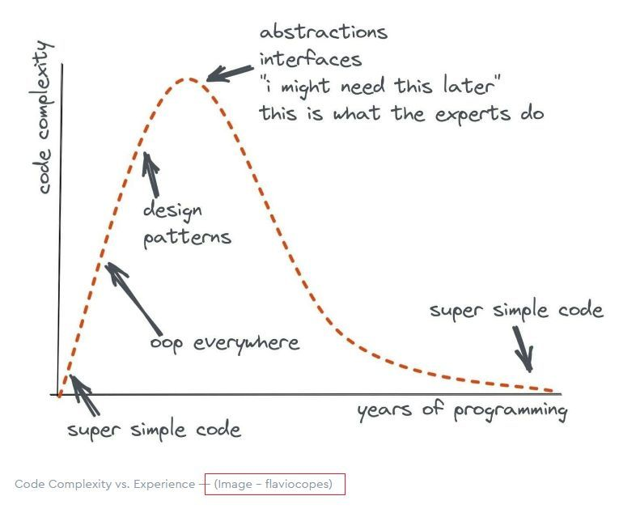
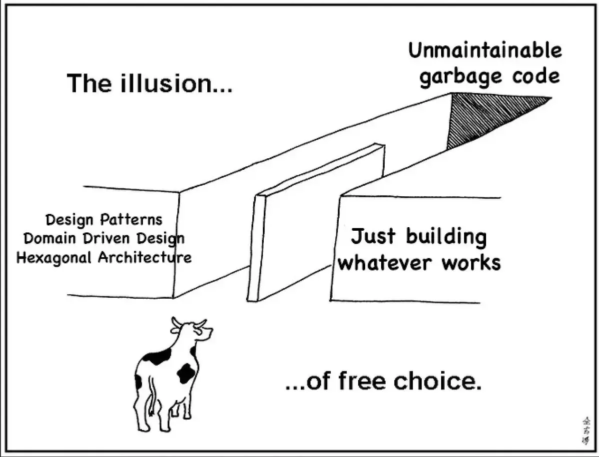

## What Are Design Patterns?
-----
In software development, just as in other fields, there are tried-and-tested solutions to common problems. These solutions are called design patterns, and they serve as guidelines that help developers create efficient, maintainable, and organized code. Think of them as recipes—well-established ways of solving problems that allow you to achieve great results without having to reinvent the wheel every time.

Instead of writing specific lines of code, design patterns provide developers with high-level solutions that can be adapted to different situations. Whether you're building a new system from the ground up or adding features to an existing app, design patterns offer structured ways to handle challenges that come up regularly. By following these proven patterns, developers can solve problems quickly and effectively, saving time and reducing errors.


Design patterns fall into three main categories:

1. **Creational Patterns**: These patterns focus on how objects are created. They help ensure that the right objects are created in the right way.

2. **Structural Patterns**: These patterns deal with how different parts of a program are organized or connected, ensuring everything fits together seamlessly.

3. **Behavioral Patterns**: These patterns describe how objects interact with each other, ensuring smooth communication between different parts of the system.


## A Simple Weather Function – Strategy Pattern
-----
Let’s explore a simple weather function that calculates the "feels like" temperature based on the actual temperature and humidity, then assigns a "danger level" (like a weather warning) based on those values. This scenario demonstrates the Strategy Pattern in action.

The **Strategy Pattern** allows you to choose from a set of interchangeable algorithms or methods to solve a problem, depending on the situation. It’s like having multiple tools at your disposal and being able to pick the best one based on your needs. And the flexibility doesn't stop there—you can swap out one strategy for another at runtime.

In the weather function, it calculates the "feels like" temperature using a formula and categorizes the result into different danger levels—"Extreme Danger," "Danger," or "Caution"—based on predefined thresholds. Although this particular implementation doesn’t directly switch between different strategies, the concept of adapting the approach depending on input (like temperature and humidity) still aligns with the Strategy Pattern.


```
function feelsLike(temp: number, humidity: number): string {
    const feels = -42.379 + (2.049 * temp) + (10.143 * humidity) - ...;
    let dangerLevel: string;

    if (feels >= 125) {
        dangerLevel = "Extreme Danger";
    } else if (feels >= 102) {
        dangerLevel = "Danger";
    } else if (feels >= 90) {
        dangerLevel = "Extreme Caution";
    } else if (feels >= 79) {
        dangerLevel = "Caution";
    } else {
        dangerLevel = "OK";
    }

    return `feels like ${feels.toFixed(2)}: ${dangerLevel}`;
}

```

In this example, the function uses conditional logic to check the calculated "feels like" temperature and determine the appropriate danger level. Imagine if we wanted to allow the system to switch between multiple formulas—say, depending on the season or geographical location. This would demonstrate a more dynamic use of the Strategy Pattern, allowing us to apply different approaches based on external factors.

In essence, the Strategy Pattern makes your code more adaptable and scalable, enabling you to easily change the way things are done without rewriting large portions of your program.


## Header Component – Composite Pattern
-----
Next up, let’s look at a common Header Component on a website. This component typically contains multiple smaller parts, such as the restaurant name, navigation links, and social media buttons. But what if you could treat all of these different parts as a single unified entity? That’s the magic of the Composite Pattern.

**The Composite Pattern** is a design solution that lets you treat individual objects and groups of objects in the same way. It’s especially useful when you need to work with complex structures that consist of multiple parts, as it allows you to treat the whole structure as one unit. This simplifies managing and organizing the components.


In this case, the website’s header is made up of smaller elements (like the logo and navigation links), but we treat the entire header as a single component. This approach makes it much easier to manage, update, and render the entire header as a cohesive whole.


```
const Header = () => (
  <div className="container-fluid">
    <header id="header" className="d-flex justify-content-between align-items-center px-3">
      <div id="dyn_logo" className="h4 text-white">
        Jade Dynasty Seafood Restaurant
      </div>
      <nav className="navbar navbar-expand-lg navbar-light">
        <button className="navbar-toggler">...</button>
        <div className="collapse navbar-collapse" id="navbarNav">
          <ul className="navbar-nav">
            <li className="nav-item">
              <Link href="/" className="nav-link">Home</Link>
            </li>
            <li className="nav-item">
              <Link href="/about" className="nav-link">About</Link>
            </li>
            <li className="nav-item">
              <Link href="/press" className="nav-link">Press</Link>
            </li>
            <li className="nav-item dropdown">...</li>
          </ul>
        </div>
      </nav>
    </header>
  </div>
);

```

This example shows that the Header is composed of smaller components (like the logo, navigation items, and dropdown menus), but they’re all grouped together as part of the same overall header. The Composite Pattern makes it easier to manage and manipulate these smaller components collectively, which is especially helpful when dealing with complex structures.

By treating the entire header as one object, we can handle it more efficiently, even though it’s made up of many smaller pieces. This is what makes the Composite Pattern so powerful in organizing complex systems.


## Shopping Cart – Observer Pattern
-----
Now, let’s switch gears and talk about something familiar to most people: an online shopping cart. When you add or remove items, you see the cart automatically update with the new total and contents. This is an excellent example of the Observer Pattern.

With the **Observer Pattern**, one part of your system (like the cart) can notify other parts (like the UI) whenever something changes. Think of it as a group of friends who are all keeping an eye on the same event. When the event happens (like an item being added or removed), they all get notified and respond accordingly.

In our shopping cart example, the CartPage component listens for changes to the cart. Whenever the cart is updated, the component reacts and re-renders the UI to reflect the latest data. This happens automatically, without the user needing to refresh the page.


```
const CartPage = () => {
  const [cartItems, setCartItems] = useState<ProjectCardData[]>([]);
  const [isClient, setIsClient] = useState(false);

  useEffect(() => {
    setIsClient(true);
    const cart = JSON.parse(localStorage.getItem('cart') || '[]');
    setCartItems(cart);

    const updateCart = () => {
      const updatedCart = JSON.parse(localStorage.getItem('cart') || '[]');
      setCartItems(updatedCart);
    };

    window.addEventListener('cartUpdated', updateCart);

    return () => {
      window.removeEventListener('cartUpdated', updateCart);
    };
  }, []);
}
```

In this example, the CartPage listens for a special event called cartUpdated, which signals that the cart has changed. When this event occurs, the component updates its state, and the UI is automatically re-rendered. This makes sure that the shopping cart is always up-to-date without the need for manual refreshing.

The Observer Pattern is a powerful way to ensure that different parts of the system stay in sync with each other. It’s especially useful when you want changes to one part of the application to automatically trigger updates in other parts, making it an excellent tool for dynamic, real-time applications.





## The Value of Design Patterns
-----

Design patterns are the secret sauce that can take your development process to the next level. They provide ready-made solutions to common problems, saving developers time and effort while ensuring that their code is organized, flexible, and easy to maintain. Let’s revisit the patterns we explored and see how they make a difference:


1. **The Strategy Pattern**: In the weather function, it helps determine the right "danger level" by using different approaches based on the conditions. It’s like having the freedom to choose the best method for each situation.


2. **The Composite Pattern**: In the header component, it helps group smaller pieces into a unified whole, making complex components easier to manage and update.


3. **The Observer Pattern**: In the shopping cart, it ensures that any changes to the cart automatically trigger an update to the UI, keeping everything in sync without needing to refresh.

By leveraging these design patterns, developers can write code that is easier to understand, more flexible, and better organized. Instead of reinventing the wheel each time, they can rely on proven solutions that have already been tested and refined. This leads to faster development, fewer bugs, and ultimately, more reliable software.

In short, design patterns are the tools that allow developers to build smarter, more efficient systems—helping them focus on solving new problems rather than re-solving the same ones over and over again.



