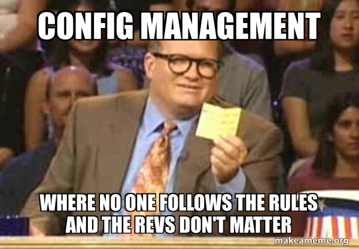
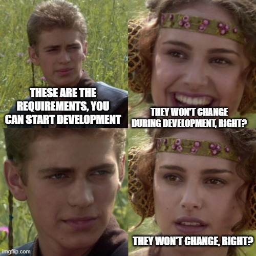

## Introduction
-----

Starting my journey in Software Engineering was both exciting and intimidating. From day one, I understood the challenge that lay ahead, especially after seeing the grade distribution for the course. I had heard from peers that this would be one of the toughest courses, which made me allocate extra time to prepare. Balancing this course with others, however, proved to be a test of my time management skills. Despite the challenges, I knew the skills I would acquire in this class would be invaluable for my future. As the course progressed, I gained a deeper understanding of key concepts like Configuration Management, Coding Standards, and Agile Project Management—each of which has shaped my approach to software development, particularly in team settings.

## Consistency is Key
-----

One of the first concepts that had a significant impact on me was Configuration Management. Initially, I didn’t fully grasp its importance, but as I became more familiar with tools like Visual Studio Code and version control systems, I started to see its value. Configuration management ensures that software systems remain consistent across different environments, which is essential for preventing errors and compatibility issues. I learned how to use the terminal for version checks, updates, and dependency management, all of which helped streamline my development process. The significance of version control, particularly with Git and GitHub, became increasingly clear. These tools allow developers to track code changes, collaborate effectively, and avoid problems arising from inconsistent code. As I continued to apply these practices, I began to appreciate how configuration management contributes to maintaining an organized and efficient development workflow, making it easier to manage projects and collaborate with others.

## Polish Code till it Shines
-----

Another essential concept I encountered was Coding Standards. Early on, I focused mostly on ensuring my code worked, without considering readability or maintainability. However, I quickly learned that adhering to coding standards is just as important as making the code function. Consistent practices like proper indentation, clear naming conventions, and thorough commenting help ensure that code is easily understandable by others (and even by myself, months later). At first, I struggled with issues like ESLint errors, which were often caused by small formatting mistakes. However, correcting these errors helped me see the importance of writing clean, consistent code. Over time, I recognized that following coding standards not only improved code quality but also made collaborative work much more efficient, as it ensured everyone could follow the logic and structure of the code.

## Agile, But Not Fragile
-----

Finally, Agile Project Management transformed the way I approached software development. Before learning about Agile, I assumed software development was a rigid, step-by-step process. Agile, however, emphasizes flexibility, collaboration, and iterative progress, which was a shift in how I viewed development. In our class projects, we worked in teams to build software incrementally, breaking down large tasks into smaller, more manageable ones. This made the entire process less overwhelming and allowed us to adapt our approach based on feedback. Agile’s focus on communication and constant feedback ensured that everyone was aligned and helped keep the project moving forward. The iterative nature of Agile allowed for continuous improvement, ensuring we could adapt to new challenges as they emerged. Working within this framework taught me the importance of flexibility and collaboration, both of which are crucial for delivering quality software in a dynamic environment.

## Conclusion
-----
In conclusion, while Software Engineering proved to be a challenging course, it has been one of the most rewarding experiences I’ve had. Through learning about Configuration Management, Coding Standards, and Agile Project Management, I have gained essential skills that will serve me well in future academic and professional endeavors. Configuration management taught me how to ensure software environments remain consistent and organized, while coding standards emphasized the importance of clean, maintainable code. Agile project management, on the other hand, showed me how flexibility and teamwork are key to delivering high-quality software. Although the course was demanding, the skills I developed have laid a strong foundation for my future in software engineering, and I look forward to continuing to grow in this field.
