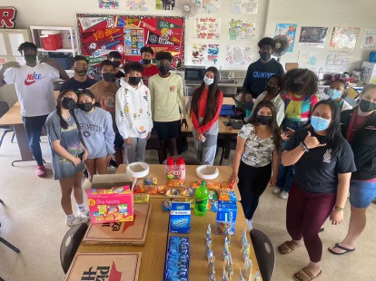

Books 4 the Homeless is a senior project I proposed to my team of classmates,
aiming to engage students from all grade levels in a book donation drive.
Our focus was on individuals who could benefit from both educational resources
and a source of comfort and entertainment. As avid readers ourselves, we wanted to share the profound benefits of reading with those who might find solace and
enrichment through books.

As the project leader, my role wasto corrdinate efforts with my three team members,
guiding our brainstorming sessions to refine our objective of donating books to the
homeless. Given the 2 month timeframe, we decided to reduce the number of donators
to focus on the AVID grade levels as there were plenty of Freshman, Sophmores, Juniors
and Seniors that we would need to provide a grand prize for, if they one. To keep
it simple and on theme, we decided to offer a pizza party for the class that donated
the most books.

I distributed the roles to each of the members based on their availability and experience.   

Phases:
------------------
I) Propose the idea to the AVID underclassmen's respective classes and being along two empty boxes that are labelled for each grade level.

II) Collect the boxes from each of the AVID grade level's classroom by the end of each week then bring them back on Monday.

III) After the designated deadline, collect the boxes one last time and thoroughly clean the books and count for each grade level's box.

IV) After properly cleaning the books, deliver them to the Institute For Human
Services Inc.

V) Present our data to the panel of judge and junior AVID class.

Final Results:
---------------------
*1st - Freshmen (236)
2nd - Sophmores (125)
3rd - Seniors (45)
4th - Juniors (0)*

Key Takeaways:
--------------------
1) Successful Communication is a Two-Way Street

2) Always Maintain Flexibility
   
3) Setbacks are Inevitable  
