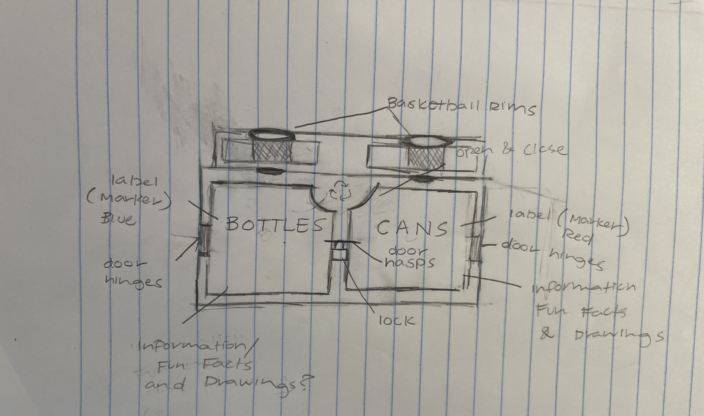
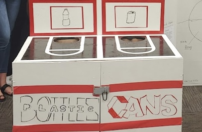

 

As I walked the halls of Radford High School, I noticed piles
of plastic waste scattered around the school, particularly near
high-traffic areas like the cafeteria and vending machines in the main hallway.

Taking a STEM Capstone course, I recognized a golden opportunity to make a meaningful impact at our school. High schools are crucial in shaping students' environmental awareness and behaviors. Therefore, implementing comprehensive plastic waste reduction programs in these institutions is essential for fostering sustainability and promoting responsible practices among students.  

Inspired by this realization, I developed a creative and engaging system designed to motivate students to sort their cans and bottles more effectively. The system incorporates interactive elements and gamification techniques to make the recycling process both fun and rewarding. By integrating visually appealing sorting stations and incentivizing correct recycling practices with small rewards or competitions, the system aims to capture students' interest and encourage consistent participation. The goal is not only to improve waste management within the school but also to instill lasting habits of environmental responsibility in students.

<pre>

After presenting this project to the panel of judges and receiving
STEM Honors, I donated the final product to Radford High School's Green
Team, where they carried on a legacy of recycling.   

</pre>

